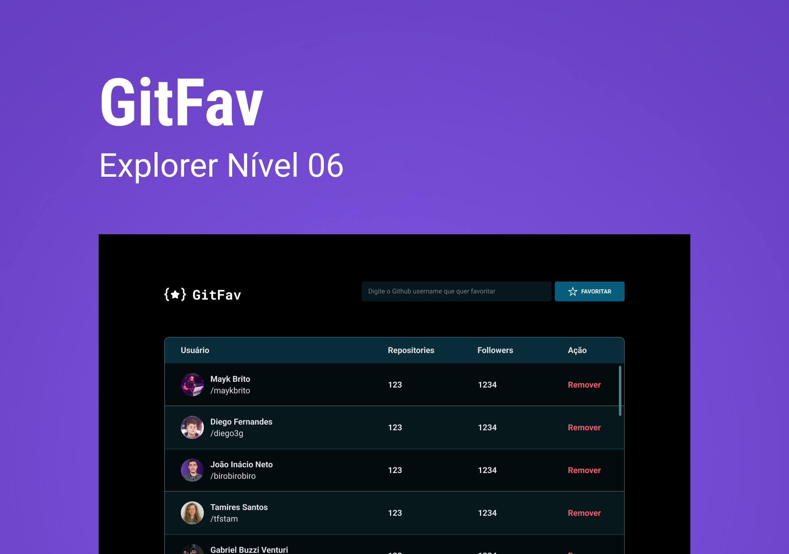

<h1 align="center">Git Fav</h1>

  <a href="#-tecnologias">Tecnologias</a>&nbsp;&nbsp;&nbsp;|&nbsp;&nbsp;&nbsp;
  <a href="#-projeto">Projeto</a>&nbsp;&nbsp;&nbsp;|&nbsp;&nbsp;&nbsp;
  <a href="#-layout">Layout</a>

 

  

## 🚀 Tecnologias

Esse projeto foi desenvolvido com as seguintes tecnologias:

- Javascript
- HTML e CSS
- Git e Github

## 💻 Projeto

Este projeto foi desenvolvido como desafio do Stage 06: JavaScript antes do Framework, do curso Explorer da Rocketseat. Este desafio consiste em criar uma aplicação que permite o usuário buscar e salvar seus usuários favoritos do Github. O objetivo deste desafio foi praticar e fixar conceitos de JavaScript aprendidos no módulo, como:

- Princípios de Orientação a Objetos
- Consumo de API
- Classes e herança
- Promises e async/await
- tratamento de erros com try, catch e throw
- localStorage
- Métodos confirm(), filter(), find(), JSON.parse() e JSON.stringify()
- Spread Operator

Além disso, criação de tabelas com HTML e diversos conceitos de CSS.

:exclamation: O principal foco deste módulo foi o aprendizado de conceitos fundamentais de JavaScript, portando, este projeto conta apenas com uma versão desktop.

### Para visualizar o projeto em funcionamento, basta clicar [neste link!](https://viviansanchez.github.io/rocketseat-explorer-stage06-desafio02/)

## 🔖 Layout

Você pode visualizar o desafio através [DESTE LINK](https://efficient-sloth-d85.notion.site/GitFav-f8ff1c18b23745c0b46cd8d61f74b596) e o respectivo layout do Figma [NESTE LINK](https://www.figma.com/file/SzQA07HwmSPj4hOYgu1Pps/%5BDesafios-Explorer%5D-GitFav/duplicate).
